# 第6組
|組員:| 學號 |姓名|
|:---:|:---:|:---:|
|6|C108118251|蔡定宸(組長)|
|1|C108118225|陳佳鈴|
|2|C108118234|許峰誠|
|3|C108118239|黃政傑|
|4|C108118241|潘彥彤|
|5|C108118244|廖荃宜|
***
### 個別組員的任務：
|工作內容      |  姓名 |  
|:--------------:|:-----:|
| 網頁美工  |   陳佳鈴、許峰誠   |
| 網頁設計  |   廖荃宜、潘彥彤   |
| 網頁後端  |   蔡定宸、黃政傑   |
***
### 題目：遊民好朋友
### 內容：我們將幫助遊民架設專屬的個人部落格，提供遊民一個介紹自己的管道，讓更多人能夠看見。
***

### 工作分解結構清單
|編號    | 任務說明	   |需時（天）	|前置任務|
|:------:|:---------:|:--------:|:-----:|
|1	    | 研擬計畫	          | 1		   | -|
|2	    | 任務分配	          | 1		   | 1|
|3	    | 繪製網頁架構圖	          | 4		 | 2|
|4	    | 建立資料庫	 | 10		 | 2|
|5	    | 實作網頁框架圖   | 10		| 2|
|6	    | 繪製網頁介面圖	     | 3		 | 3|
|7	    | 網頁後端搭建	      | 3		  | 4,5|
|8	    | 實作網頁	         | 4		 | 6|
|9	    | 網頁後端測試	      | 1		  | 8|
|10	    | 整體網頁測試	          | 3		 | 8|

### PERT/CPM圖
.png "PERT/CPM圖")
### 甘特圖
.png "甘特圖")
***
## 功能性需求
1. 簡單快速的搭建個人部落格
2. 線上客服人員
3. 提供相關的政府補助資訊
4. 網站使用說明
5. 捐助功能
## 非功能性需求
1. 反應時間(response time) ：網頁載入時間不超過1秒，線上客服的系統回覆時間不超過5秒。
2. 使用性(usability)：網頁介面簡潔，只會顯示當前網頁需要的資訊，不會顯示其他不必要的資訊。
3. 可靠度(reliability)：系統可24小時上線，除非伺服器所在地停電。
4. 效能(performance)：採用多執行緒，能承載100人同時發送請求。
5. 維護性(maintainability)：主要採用Javascript進行開發，變數名稱都以駝峰式大小寫規則進行命名。
## 功能分解圖(functional decomposition diagram,FDD)
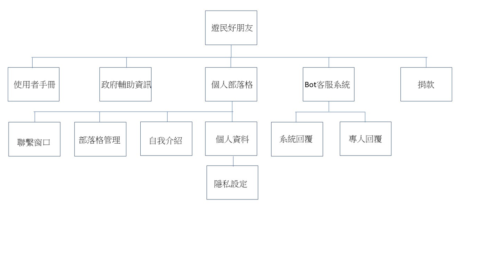
## 需求分析
### 架設遊民好朋友網站的需求分析簡述如下：
1. 使用者可以根據網頁提供的模板來快速架設自己的部落格。
2. 符合特定資格的使用者會有專人協助架設自己的部落格。
3. 提供線上客服系統，讓使用者不需依靠其他平台也能直接與我們聯絡。
4. 網頁會不定時更新政府相關補助資訊，進而幫助符合資格的使用者。
5. 針對網頁使用方式，我們將提供網站使用說明書讓使用者快速上手。
6. 對於願意捐助的使用者，經過與我們接洽確認後，我們將會提供相關聯絡方式。
#### 基於以上的需求描述，請繪製可能的使用案例圖。
## 使用案例圖
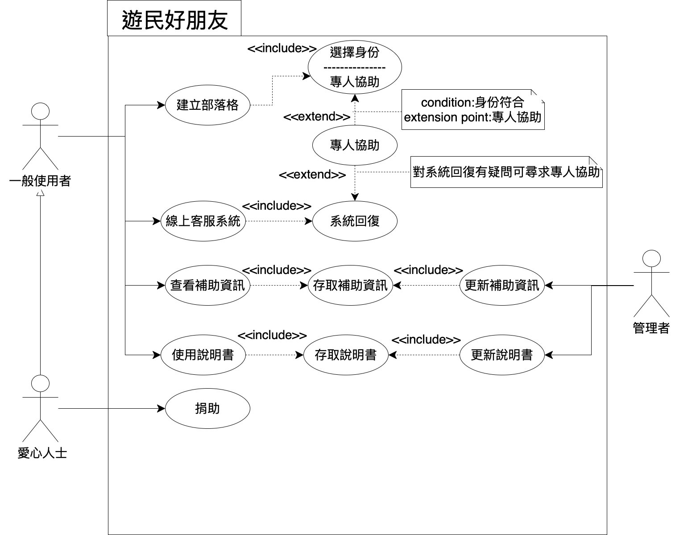
## 使用案例分析
### 第一例
| 使用案例名稱  | 建立部落格  | 
| :------------: |:---------------|
| 行動者 | 使用者 | 
| 說明 | 描述使用者點擊「建立部落格」的過程 | 
| 完成動作 | 1. 使用者點擊「建立部落格」的標籤   2. 依照提示輸入姓名、個人故事、相片及聯絡方式   3. 系統將會自動生成一份部落格| 
| 替代方法 | 1. 使用者點擊「建立部落格」的標籤   2. 未依照提示輸入所有資料   3. 系統傳送未完成訊息 |  
| 先決條件 | 使用者必須先選擇「身份」 |
| 後置條件 | 建立部落格後，使用者可繼續瀏覽其他分頁 | 
| 假設 | 無 | 

### 第二例
| 使用案例名稱  | 線上客服系統  | 
| :------------: |:---------------|
| 行動者 | 使用者 | 
| 說明 | 描述使用者點擊「線上客服系統」的過程 | 
| 完成動作 | 1. 使用者點擊「線上客服系統」的圖示   2. 利用文字框提示查看自己遇到的問題屬於哪一類   3. 系統將會提供最佳解答| 
| 替代方法 | 1. 使用者點擊「線上客服系統」的圖示   2. 找不到類似問題，使用者自行輸入   3. 系統傳送專人服務訊息 |  
| 先決條件 | 使用者必須先填寫email |
| 後置條件 | 聯繫客服後，使用者可繼續瀏覽其他分頁 | 
| 假設 | 無 | 

### 第三例
| 使用案例名稱  | 查看補助資訊  | 
| :------------: |:---------------|
| 行動者 | 使用者 | 
| 說明 | 描述使用者點擊「查看補助資訊」的過程 | 
| 完成動作 | 1. 使用者點擊「查看補助資訊」的標籤   2. 選擇身份、補助類別   3. 系統將會跳出補助資訊| 
| 替代方法 | 1. 使用者點擊「查看補助資訊」的標籤   2. 選擇身份、補助類別   3. 系統傳送不符合資格訊息 |  
| 先決條件 | 使用者必須先勾選身份 |
| 後置條件 | 查看補助資訊後，使用者可繼續瀏覽其他分頁 | 
| 假設 | 無 | 

### 系統環境圖 (DFD)
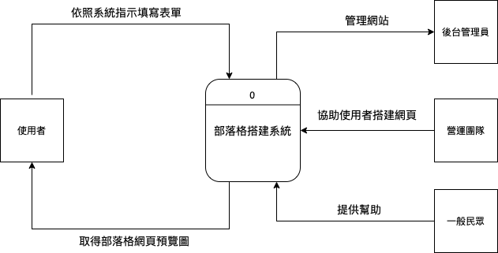
### DFD圖0
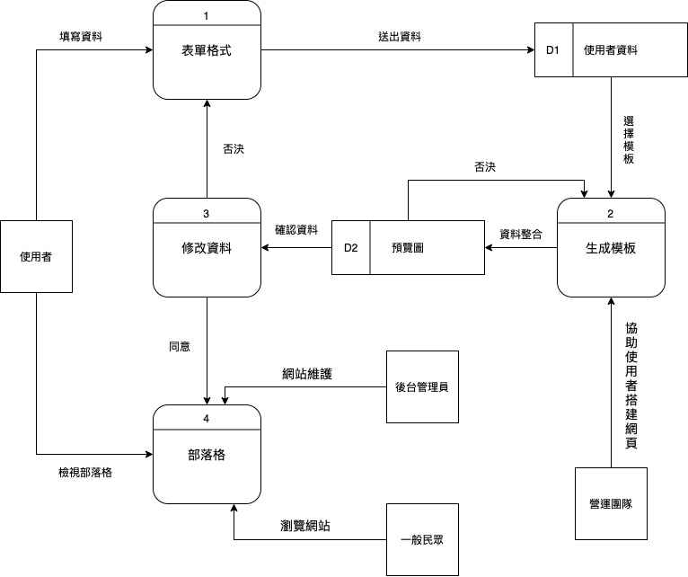
### UML 類別圖(class Diagram)
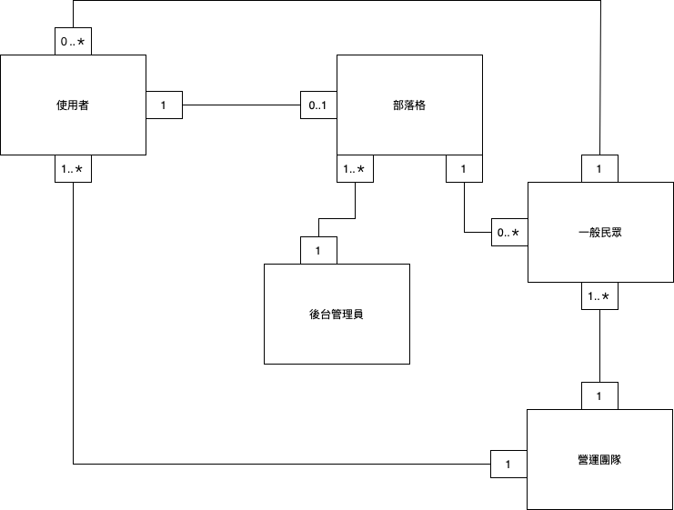
### 使用案例一 建立部落格
#### 循序圖
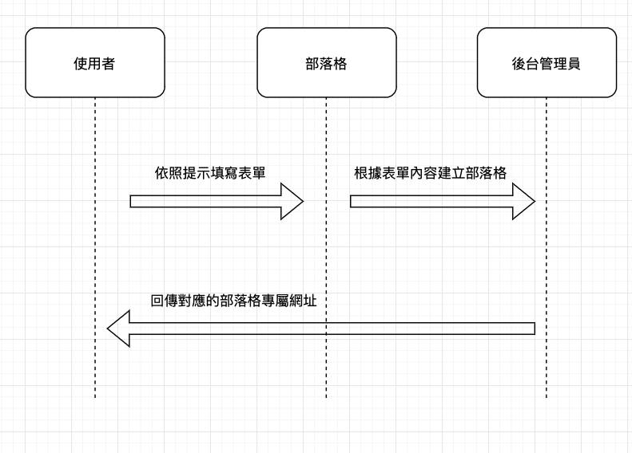
#### 活動圖
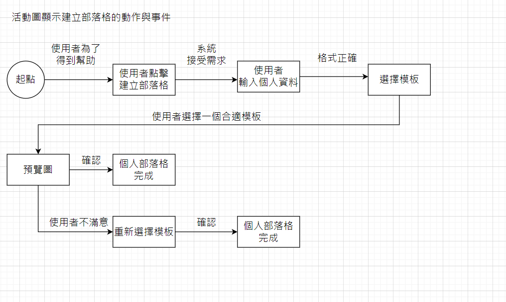

### 使用案例2 線上客服系統
#### 循序圖
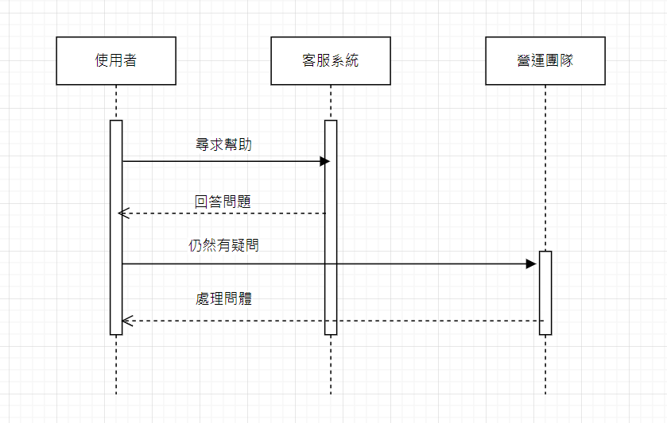
#### 活動圖
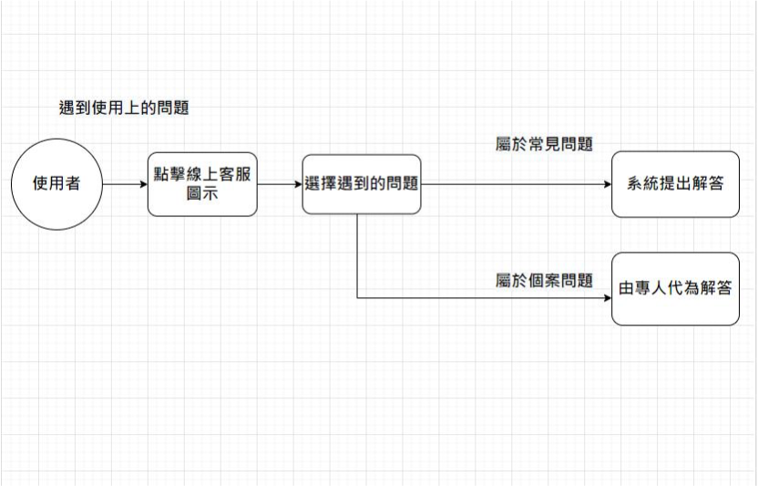

### 使用案例三 查看補助資訊
#### 循序圖
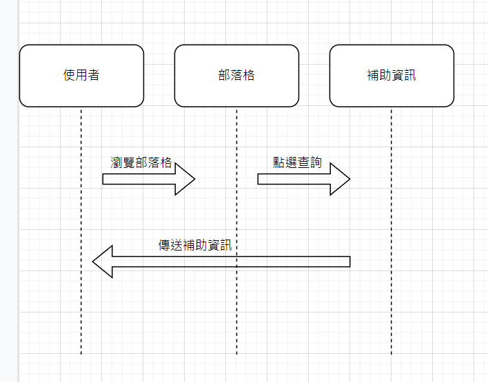
#### 活動圖
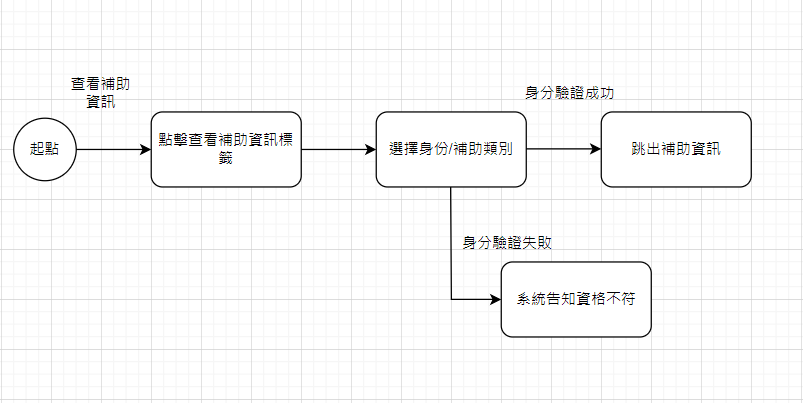
## 分鏡板(storyboard)
### 主頁

### 功能簡介
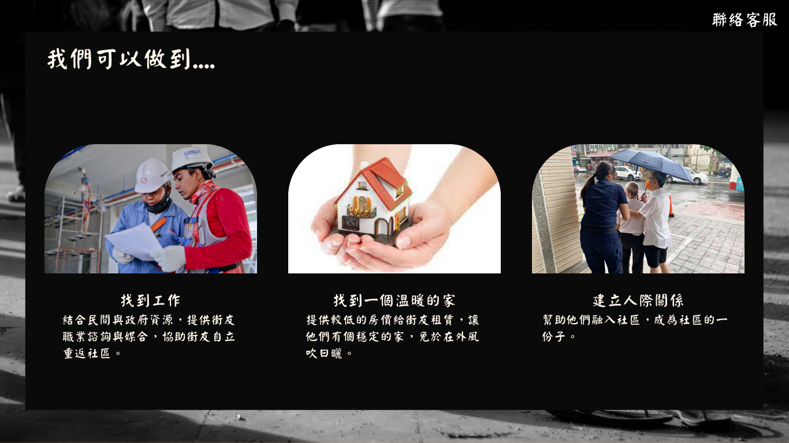
### 架設網站動機

### 登入介面
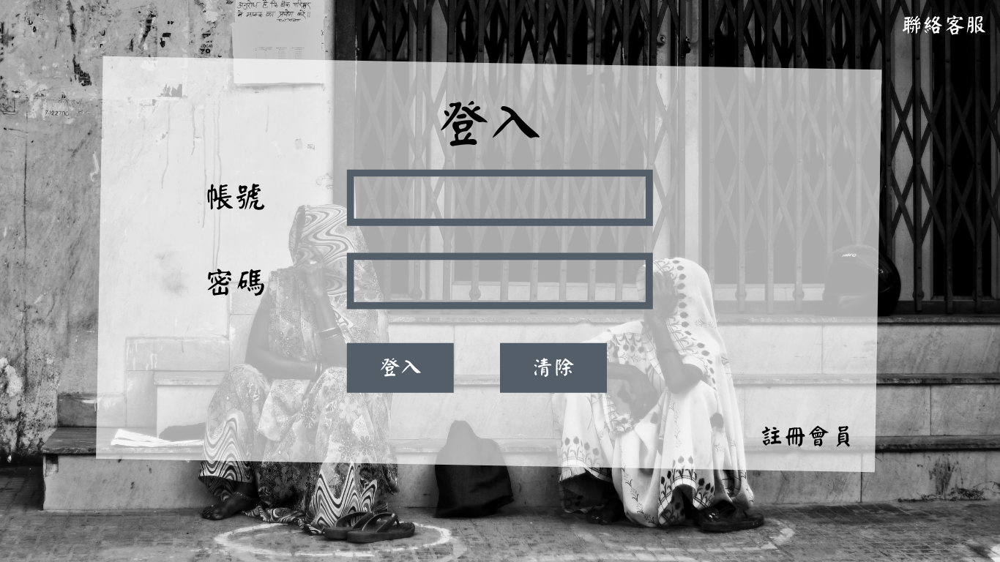
### 註冊會員
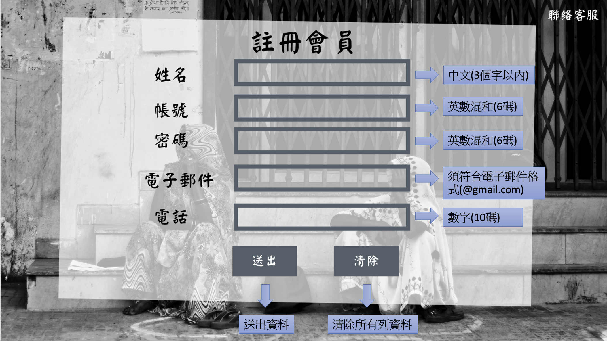
### 建立個人部落格
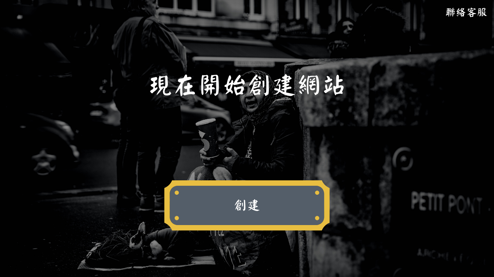
### 填入基本資料
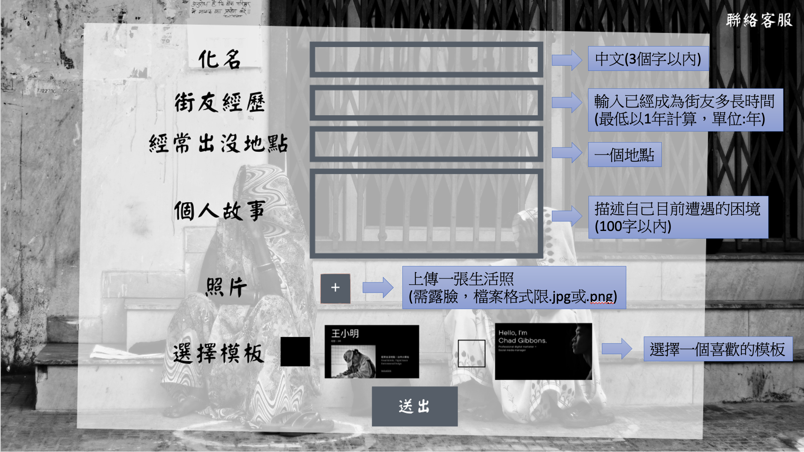
### 個人部落格

### 贊助功能
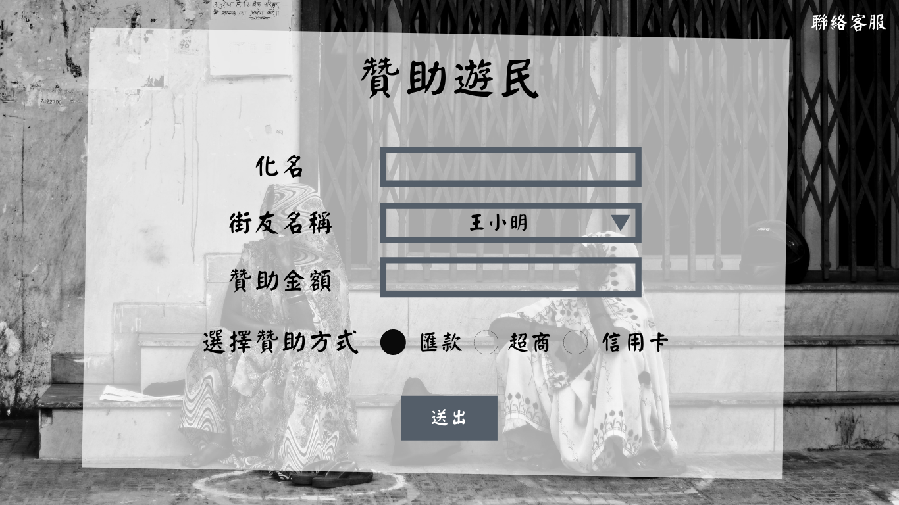
### 客服系統
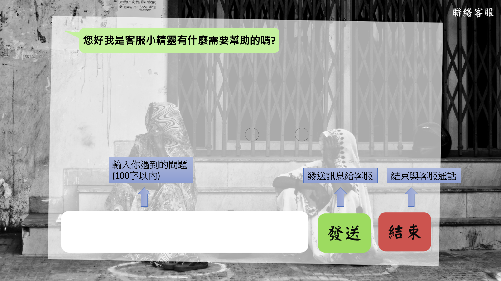
### 實體關係圖(entity-relationship diagram, ERD)
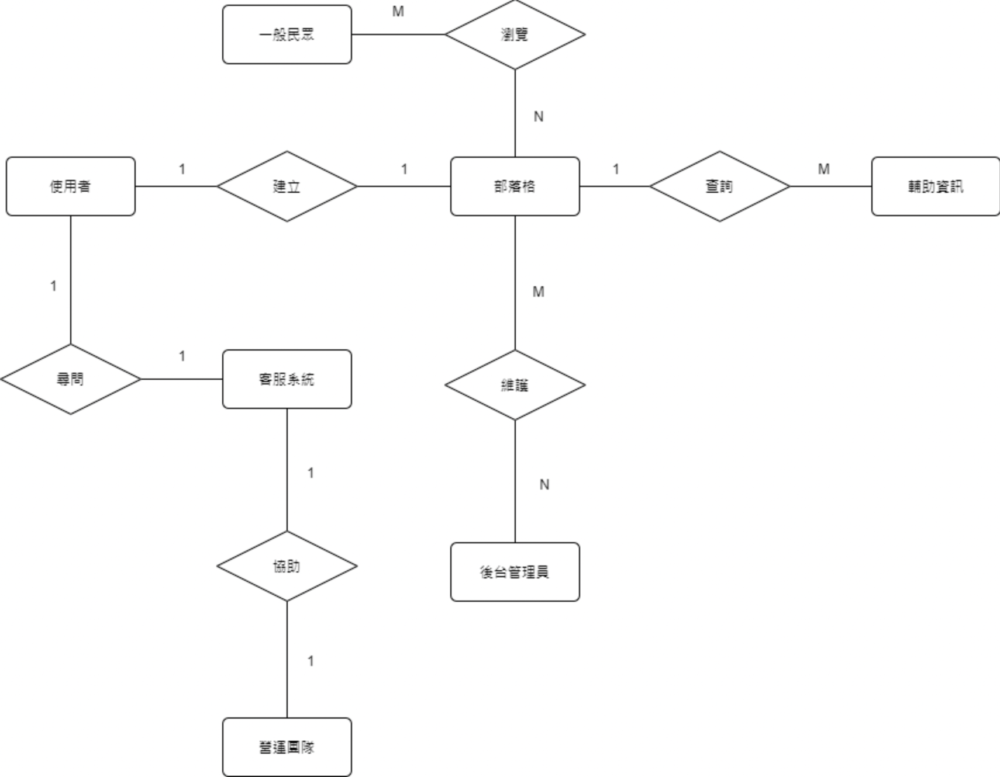
### 程式DEMO
https://drive.google.com/file/d/1LZHr3Q8E8kbzOqnTsgVuBTlTKIh696nW/view?usp=sharing
